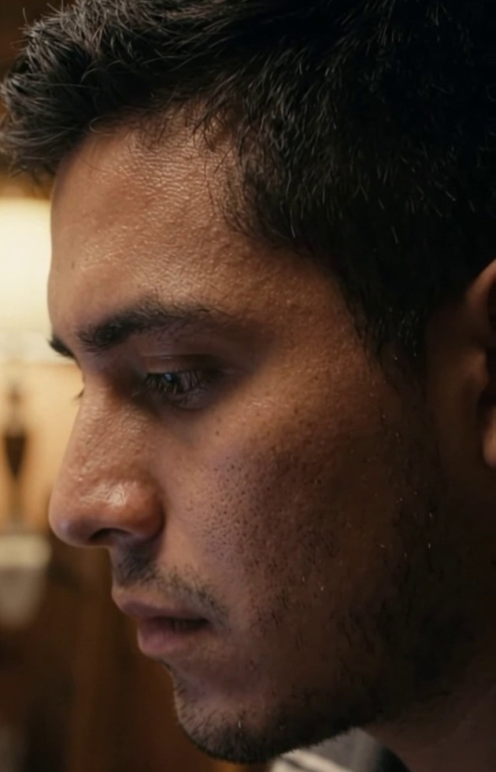
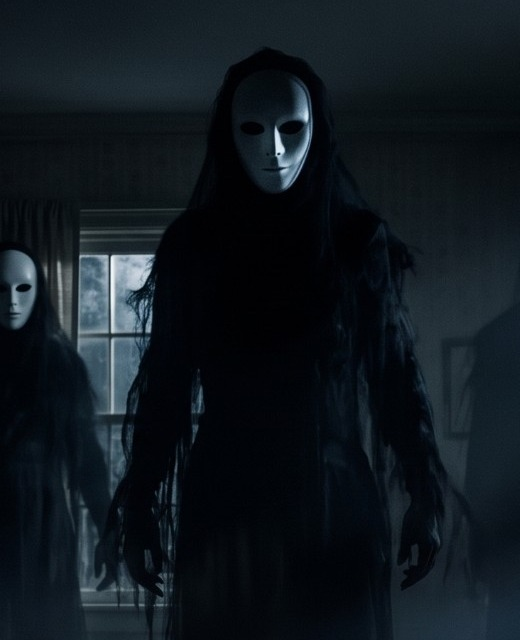
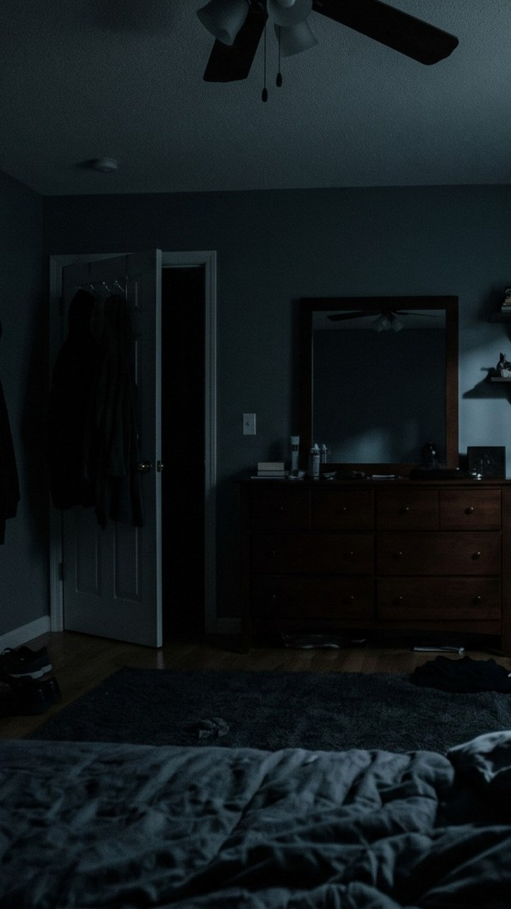
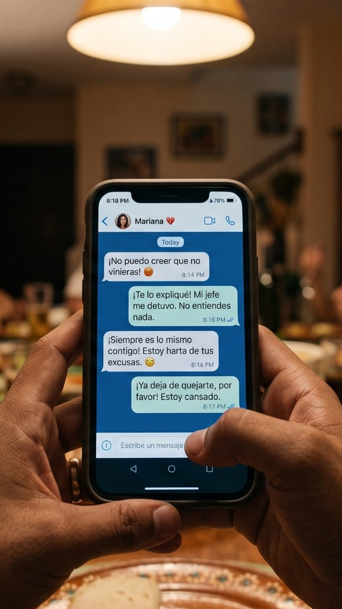
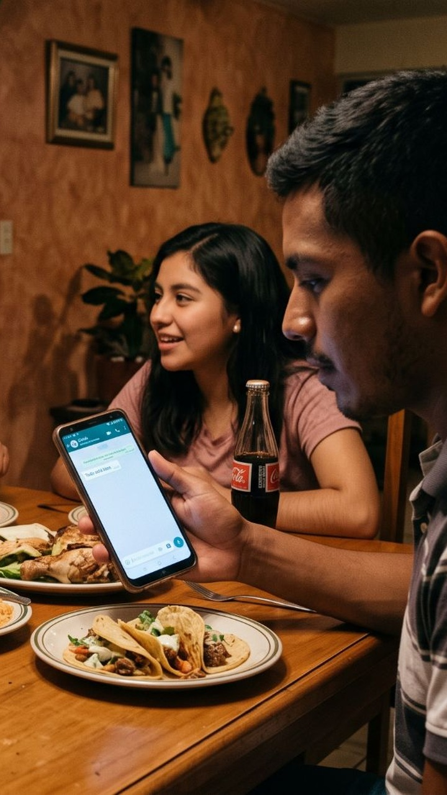
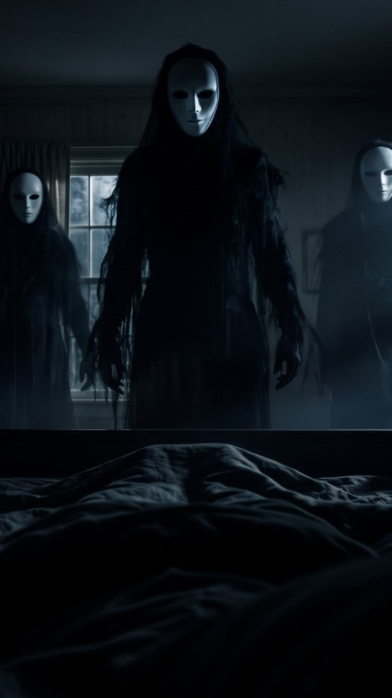
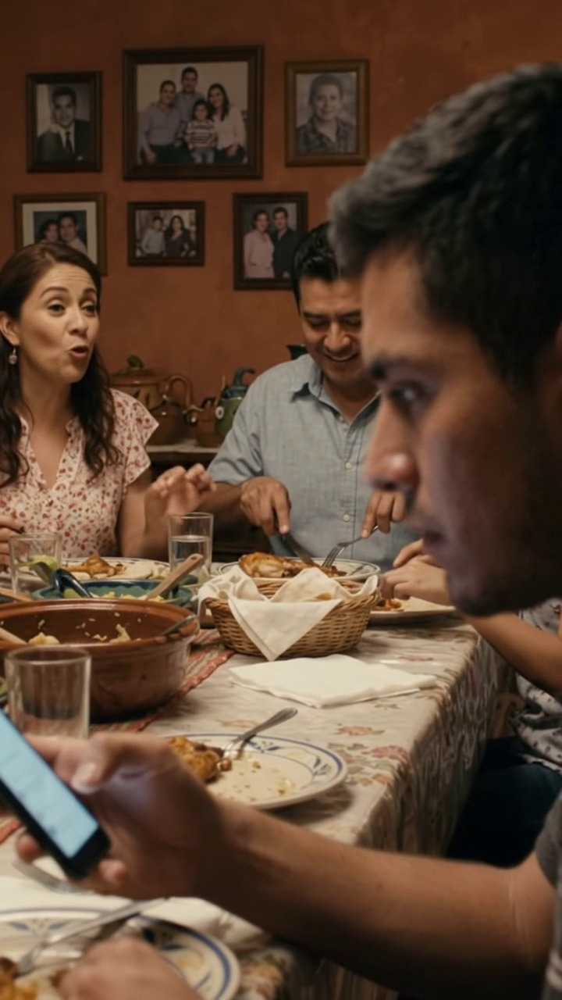
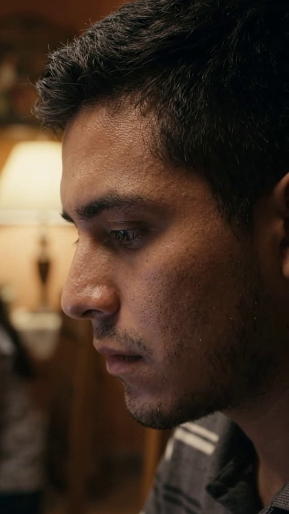

<!-- Archivo generado por herramientas/generar.py a partir de plan.json. Edita plan.json y vuelve a generar. -->

# La Incisión · Shotlist para Kling AI

Alex, de 22 años, cena con su familia pero tiene la cabeza en una pelea con su novia. Esa noche, paralizado en su cama, tres figuras con máscaras blancas lo rodean. A la mañana siguiente descubre en su brazo una incisión con suturas perfectas: no fue un sueño.

**Formato:** 9:16 vertical para TikTok · 1080×1920 · 24 fps  
**Planos:** 20 (1 opcional) · **Montaje:** 1:49 · **Generación:** 160 s por pasada completa

Los prompts de las imágenes que faltan están en [keyframes.md](keyframes.md). La versión visual, con botones para copiar, es [storyboard.html](storyboard.html) (ábrela en el navegador). Los mismos planos adaptados a Gemini Omni están en [gemini-omni.md](gemini-omni.md).

## Antes de empezar

### Flujo

1. Sube las referencias verticales (referencias/vertical/) a Kling y crea los Elements «Alex» y «Figura» con los recortes de la carpeta elements/.
2. Genera los keyframes K0–K10 (imágenes verticales 9:16) y revisa la lista de continuidad.
3. Genera los planos escena por escena: primero un borrador en modo rápido y luego la toma final.
4. Elige la mejor toma de cada plano y guárdala con su ID (por ejemplo 3A_v2.mp4).
5. Graba o genera las voces y junta los efectos de sonido de cada escena.
6. Monta en CapCut o DaVinci Resolve siguiendo la línea de tiempo y postproduccion.md.

### Ajustes en Kling

| Ajuste | Valor |
|---|---|
| Modelo | Kling 3.0 o la versión más reciente de tu plan. Borradores en modo rápido (Turbo o Estándar); tomas finales en Pro o alta calidad. |
| Proporción | 9:16 vertical para TikTok. Usa como primer cuadro las versiones verticales de referencias/vertical/. |
| Modo | Imagen a video con fotograma inicial en todos los planos. Fotograma final solo en 2B. |
| Duración | La que marca «Genera» (5 o 10 s). Kling 3.0 llega a 15 s, pero los clips cortos se deforman menos. |
| Elements | «Alex» y «Figura», en los planos que los indican, si tu versión permite combinarlos con el fotograma inicial. Si no, manda el fotograma inicial. |
| Idioma | Prompts en inglés, que Kling sigue mejor. Los diálogos van en español, entre comillas. |
| Audio nativo | Apagado por defecto: el sonido se arma en la edición. Enciéndelo solo en 1A–1C si quieres que Kling genere las voces en español. |
| Negative prompt | Pégalo cuando tu versión muestre el campo. |
| Multi-shot | Opcional en Kling 3.0: agrupa planos de una misma escena (hasta 6) pegando cada prompt como un plano. |
| Intentos | Calcula 2 o 3 generaciones por plano. Una pasada completa son unos 160 s de video. |

### Elements

| Element | Imagen | Cómo se arma | Úsalo en |
|---|---|---|---|
| **Alex** |  | Recorte del rostro de Alex en el último cuadro de tu toma 1A + la hoja de personaje K0. Es la cara que ya quedó en el corto. | 1A, 1C, 2C, 3B, 5E, 6A, 6B y los insertos del brazo (3C, 5D, 6C) para mantener el tono de piel. |
| **Figura** |  | Recorte de la figura central de la ref. 05: máscara, cabello y tela negra desgarrada. | 2B, 2D, 3A, 5B y 5C. |

### Referencias

| Ref. | Imagen | Qué es | Se usa en |
|---|---|---|---|
| 01 |  | **Habitación de Alex, noche.** POV desde la cama: ventilador de techo, puerta entreabierta con ropa colgada y cómoda con espejo. El recorte vertical deja fuera la ventana y el reloj. | 2A, 2B (inicio), 5F · base de K2, K4 y K6 |
| 02 |  | **El recuerdo en el parque.** La abuela, mamá y papá jóvenes, con Alex de niño en los hombros de su papá, en hora dorada. | 4A |
| 03 |  | **POV del chat con Mariana.** Las manos de Alex con el celular en la cena y la pelea con Mariana en pantalla. | 1B · base de K1 |
| 04 |  | **La cena familiar.** Mamá, papá, hermana y Alex (polo a rayas) en el comedor. En su celular se lee «Todo está bien». | 1A (solo si la regeneras) · base de K0 y K10 |
| 05 |  | **Las tres figuras.** Figuras altas de tela negra y cabello largo con máscaras blancas. La habitación no es la de la ref. 01 (ver continuidad). | 5B · Element «Figura» · base de K2, K4 y K5 |
| 06 |  | **Toma 1A: el comedor y la familia.** Cuadro del segundo 2.5 de tu toma 1A de Gemini Omni. Desde ahora, esta es la familia y este es el comedor del corto. | Referencia de familia y comedor · base de K7 |
| 07 |  | **Toma 1A: último cuadro.** El último cuadro de tu toma 1A: Alex en primer plano. Es el primer cuadro de 1C, para que el corte no se note. | 1C (inicio) |

### Continuidad: revisa esto antes de generar

- **Nota · La familia ahora es la de tu toma 1A.** Gemini cambió a la familia y el comedor de tu imagen 4. Como la toma quedó bien, esa es la familia del corto: 1C empieza en su último cuadro (ref. 07) y la escena 6 usa su comedor (ref. 06). Si prefieres la familia original, regenera 1A con la ref. 04 vertical.
- **Corrige · La ref. 05 es otra habitación.** Tiene papel tapiz, dos ventanas y la cómoda a la izquierda; no coincide con la ref. 01. Usa la 05 solo para las figuras y genera K2 y K4 sobre la habitación de la ref. 01.
- **Corrige · La ref. 03 no coincide con tu toma 1A.** Al fondo hay otra familia, el celular tiene funda dorada y la pantalla mezcla la muesca de iPhone con botones de Android. Con el fondo muy desenfocado pasa; para ir a lo seguro, usa la ruta pro con K1.
- **Decide · Máscaras con o sin facciones.** El guion dice «lisa, sin facciones»; en la ref. 05 tienen cuencas negras y rasgos suaves. Los prompts usan «smooth white porcelain masks with hollow black eyes». Para seguir el guion al pie de la letra, cambia esa frase por «completely featureless white masks, no eyes, no mouth» en todos los prompts.
- **Revisa · Brazo izquierdo.** Los generadores suelen invertir izquierda y derecha. En K5, K9, 3C, 5D y 6C confirma que sea el izquierdo; si no, voltea la imagen horizontalmente antes de animarla.
- **Revisa · Vestuario de Alex.** Polo blanca con rayas grises solo en la escena 1. Playera gris lisa de manga corta en la noche y en el desayuno, para que el antebrazo se vea en la escena 6.
- **Nota · Anillo en la ref. 03.** Las manos llevan un anillo que se lee como de matrimonio, y Alex tiene 22 años y novia. Quítalo en K1 o ignóralo.
- **Nota · Celular sobre la mesa.** El guion dice «debajo de la mesa», pero en las refs 03 y 04 está sobre la mesa. No cambia la historia.
- **Nota · El recuerdo es el pasado.** En la ref. 02 los papás son más jóvenes (el papá sin bigote) y aparece la abuela: léelo como la infancia de Alex, con él de niño en los hombros de su papá. El papá usa una polo a rayas, como Alex en la cena.
- **Nota · El reloj marca 03:14.** Se ve en la ref. 01 original, pero el recorte vertical lo deja fuera. Si quieres ese detalle (o la idea del «tiempo perdido» de la biblia visual), agrégalo en la edición.

<a id="linea-de-tiempo"></a>

## Línea de tiempo del montaje

| Entra | Sale | Dura | Plano | Escena |
|---|---|---|---|---|
| 0:00 | 0:08 | 8 s | [**1A** · La cena](#1a) | 1 |
| 0:08 | 0:16 | 8 s | [**1B** · POV: el chat](#1b) | 1 |
| 0:16 | 0:22 | 6 s | [**1C** · «Sí, ma. Todo bien.»](#1c) | 1 |
| 0:22 | 0:23 | 1 s | _Negro: Corte a negro en silencio_ | 1 |
| 0:23 | 0:31 | 8 s | [**2A** · La habitación en penumbra](#2a) | 2 |
| 0:31 | 0:38 | 7 s | [**2B** · Aparecen las tres sombras](#2b) | 2 |
| 0:38 | 0:41 | 3 s | [**2C** · El cuerpo no responde](#2c) | 2 |
| 0:41 | 0:49 | 8 s | [**2D** · Se deslizan hacia él](#2d) | 2 |
| 0:49 | 0:55 | 6 s | [**3A** · Las máscaras encima](#3a) | 3 |
| 0:55 | 0:59 | 4 s | [**3B** · El grito sin voz](#3b) | 3 |
| 0:59 | 1:04 | 5 s | [**3C** · La extremidad oscura](#3c) | 3 |
| 1:04 | 1:12 | 8 s | [**4A** · El parque](#4a) | 4 |
| 1:12 | 1:15 | 3 s | [**5A** · El recuerdo se rompe](#5a) | 5 |
| 1:15 | 1:16 | 1 s | [**5B** · Flash: la máscara ladea la cabeza](#5b) | 5 |
| 1:16 | 1:17 | 1 s | [**5C** · Flash: el techo girando](#5c) | 5 |
| 1:17 | 1:18 | 1 s | [**5D** · Flash: recupera el brazo](#5d) | 5 |
| 1:18 | 1:22 | 4 s | [**5E** · Despierta de golpe](#5e) | 5 |
| 1:22 | 1:28 | 6 s | [**5F** · El cuarto vacío](#5f) | 5 |
| 1:28 | 1:36 | 8 s | [**6A** · Desayuno en silencio](#6a) | 6 |
| 1:36 | 1:40 | 4 s | [**6B** · El ardor](#6b) | 6 |
| 1:40 | 1:45 | 5 s | [**6C** · No fue un sueño](#6c) | 6 |
| 1:45 | 1:49 | 4 s | _Título: «LA INCISIÓN» sobre negro_ | 6 |

## Escena 1 · La cena

`INT. COMEDOR CASA MEXICANA - NOCHE`

La familia cena y platica animada. Alex está ahí, pero su cabeza está en la pelea con Mariana.

- **Luz:** Tungsteno cálido. Ámbar de la lámpara colgante y paredes terracota. La luz fría del celular en la cara de Alex lo separa de la calidez familiar.
- **Paleta:** Tungsteno `#D08A3A` · Terracota `#9C5534` · Madera `#6B3F22` · Pantalla `#6F9CC8`
- **Sonido:** Plática familiar, cubiertos y una radio lejana. Conforme la cámara llega a Alex, todo se filtra como bajo el agua y sube un zumbido grave. La voz de la madre entra amortiguada y se aclara de golpe en «¿Alex?».

<a id="1a"></a>

### 1A · La cena


| Genera | Usa | Fotograma inicial | Fotograma final | Elements |
|---|---|---|---|---|
| 10 s | 8 s | Ref. 04 | — | Alex |

**Cámara:** Dolly-in lento que deriva hacia Alex; el foco pasa de la familia a él.  
**Qué pasa:** La familia platica y se pasa los platos; Alex, inmóvil, mira el celular. La cámara se acerca despacio y el foco pasa de la familia a su cara.

**Prompt**

```text
Slow cinematic dolly-in on a lively Mexican family dinner at night. The mother talks animatedly and gestures with her hands, the father smiles while cutting his chicken, and the sister laughs and reaches for the tortilla basket. Only the young man in the striped polo shirt in the foreground stays completely still, head down, staring at the phone in his hand, his face lit by the cold glow of the screen. As the camera drifts toward him, the focus slowly shifts from the family to his face, and the family softens into warm, blurry bokeh. Warm tungsten light from a hanging lamp, terracotta walls, framed family photos. Photorealistic, 35mm film look, shallow depth of field, natural film grain.
```

**Negative prompt**

```text
blurry, low quality, distorted face, deformed hands, extra fingers, extra limbs, morphing, warped text, gibberish text, subtitles, captions, watermark, logo, cartoon, anime, plastic CGI look, oversaturated, flickering
```

**Audio nativo** (opcional: pégalo al final del prompt si activas el audio)

```text
Audio: lively family chatter in Mexican Spanish, clinking cutlery and plates, a radio playing softly in the kitchen. The voices become muffled as the camera gets closer to the young man.
```

> En la ref. 04 el celular está sobre la mesa y el guion dice «debajo». No cambia la historia; si te importa, corrígelo en el keyframe.

<a id="1b"></a>

### 1B · POV: el chat


| Genera | Usa | Fotograma inicial | Fotograma final | Elements |
|---|---|---|---|---|
| 10 s | 8 s | Ref. 03 (o [K1 · Celular con pantalla verde (ruta pro)](keyframes.md#k1)) | — | — |

**Cámara:** POV en mano con vaivén de respiración; fondo desenfocado.  
**Qué pasa:** Vemos el chat por los ojos de Alex. El pulgar desliza, las manos tiemblan y las letras se desenfocan un instante. La voz de la madre entra amortiguada.

**Prompt**

```text
First-person POV of a young man holding a smartphone with both hands at a family dinner table at night. His thumb slowly scrolls the chat on the screen. His hands tremble slightly with tension and the phone rises and falls gently with his breathing. For a moment the focus drifts and the text on the screen softens, as if his eyes lose focus from stress, then it sharpens again. In the background the family keeps eating and talking, completely out of focus in warm bokeh. Warm tungsten light from a hanging lamp. Photorealistic, 35mm film look, shallow depth of field, natural film grain.
```

**Negative prompt**

```text
blurry, low quality, distorted face, deformed hands, extra fingers, extra limbs, morphing, warped text, gibberish text, subtitles, captions, watermark, logo, cartoon, anime, plastic CGI look, oversaturated, flickering
```

**Audio nativo** (opcional: pégalo al final del prompt si activas el audio)

```text
Audio: family chatter and cutlery heard muffled, as if underwater, under a low hum. Then a warm middle-aged Mexican woman's voice off-screen, growing clearer, says in Spanish: "...y entonces le dije a tu tía que no íbamos a poder ir el domingo. ¿Alex? ¿Me estás escuchando, mijo?"
```

> Ruta rápida: usa la ref. 03 tal cual (el texto puede deformarse un poco). Ruta pro: genera desde K1 (pantalla verde) y en la edición pon una grabación real del chat que empiece en «Todo está bien» y baje hasta la pelea.

<a id="1c"></a>

### 1C · «Sí, ma. Todo bien.»


| Genera | Usa | Fotograma inicial | Fotograma final | Elements |
|---|---|---|---|---|
| 10 s | 6 s | Ref. 07 | — | Alex |

**Cámara:** Plano medio corto, fijo.  
**Qué pasa:** Alex bloquea el celular, levanta la vista y finge media sonrisa: «Sí, ma. Todo bien.» La sonrisa se le borra en cuanto dejan de mirarlo.

**Prompt**

```text
Medium close-up of Alex, a tired 22-year-old Mexican man with brown skin, short black hair and a thin mustache, wearing a white and gray striped polo shirt, sitting at a family dinner table at night. He quickly locks his phone and the screen goes dark. He looks up toward his mother off-screen, forces a small, unconvincing half-smile and says quietly: "Sí, ma. Todo bien." A moment later the smile fades and his eyes drop again, empty and exhausted. Warm tungsten light, the family dinner blurred in the background. Photorealistic, 35mm film look, shallow depth of field, natural film grain.
```

**Negative prompt**

```text
blurry, low quality, distorted face, deformed hands, extra fingers, extra limbs, morphing, warped text, gibberish text, subtitles, captions, watermark, logo, cartoon, anime, plastic CGI look, oversaturated, flickering
```

**Audio nativo** (opcional: pégalo al final del prompt si activas el audio)

```text
Audio: Alex speaks in Mexican Spanish with a tired, flat voice. Muffled family chatter continues in the background.
```

> Si no usas audio nativo, genera sin sonido y aplica después el Lip Sync de Kling con la voz grabada.

## Escena 2 · Las tres sombras

`INT. HABITACIÓN DE ALEX - NOCHE`

Corte directo a la oscuridad. Alex, agotado, está por dormirse cuando tres figuras con máscara blanca aparecen en su cuarto. No puede moverse.

- **Luz:** Luna fría. Azul luna y negros profundos. El rojo del reloj (03:14) es el único acento cálido.
- **Paleta:** Noche `#0E1620` · Azul luna `#3E5E7C` · Sombra `#26313B` · Reloj `#D2232A`
- **Sonido:** Corte seco a silencio total (1 s). Después, tono de cuarto: respiración pausada, zumbido del ventilador, un perro a lo lejos y crujidos de la casa. Al aparecer las figuras entra un drone grave que crece y un pitido agudo tipo acúfeno; la respiración se acelera.

<a id="2a"></a>

### 2A · La habitación en penumbra


| Genera | Usa | Fotograma inicial | Fotograma final | Elements |
|---|---|---|---|---|
| 10 s | 8 s | Ref. 01 | — | — |

**Cámara:** POV desde la almohada, fijo.  
**Qué pasa:** Penumbra y silencio. Las sombras de los rincones se estiran de forma antinatural. Alex parpadea, pesado.

**Prompt**

```text
Static first-person POV from a bed in a dark bedroom at night, as if lying on the pillow and looking into the room. The camera does not move. Everything is silent and still. The ceiling fan turns very slowly and the curtain moves slightly. The shadows in the corners of the room slowly stretch and creep up the walls in an unnatural way, as if they were alive. Faint light from the window flickers on the walls. No people in the room. Cold blue moonlight, deep black shadows. Photorealistic horror film look, low-key lighting, heavy film grain.
```

**Negative prompt**

```text
blurry, low quality, distorted face, deformed hands, extra fingers, extra limbs, morphing, subtitles, captions, watermark, logo, cartoon, anime, plastic CGI look, flickering, bright light, daylight, warm colors, colorful, cheerful
```

> El parpadeo pesado de Alex se hace en la edición (párpados negros que bajan y suben), no en el generador.

<a id="2b"></a>

### 2B · Aparecen las tres sombras


| Genera | Usa | Fotograma inicial | Fotograma final | Elements |
|---|---|---|---|---|
| 10 s | 7 s | Ref. 01 | [K2 · La habitación con las tres figuras](keyframes.md#k2) | Figura |

**Cámara:** POV fijo, mismo encuadre que 2A.  
**Qué pasa:** La oscuridad de la esquina se espesa y de ella salen tres figuras altas con máscara blanca. Se quedan quietas, observándolo.

**Prompt**

```text
Static first-person POV from a bed in a dark bedroom at night. The camera does not move. In the far corner, between the half-open door and the dresser, the darkness slowly thickens and takes shape: three tall, thin figures emerge from the shadows one by one and stand perfectly still, silently facing the bed. They have long bodies of tattered black cloth, long black hair and smooth white porcelain masks. Once they appear, they do not move at all. Cold blue moonlight, deep black shadows, photorealistic horror film look, low-key lighting, heavy film grain.
```

**Negative prompt**

```text
blurry, low quality, deformed hands, extra fingers, extra limbs, morphing, subtitles, captions, watermark, logo, cartoon, anime, plastic CGI look, flickering, bright light, daylight, colorful, walking legs, visible feet, realistic human faces, smiling masks, clown makeup, gore, blood
```

> Único plano con fotograma inicial y final: la IA interpola la aparición. Por eso K2 se hace sobre la ref. 01, con el mismo encuadre.

<a id="2c"></a>

### 2C · El cuerpo no responde (opcional)

| Genera | Usa | Fotograma inicial | Fotograma final | Elements |
|---|---|---|---|---|
| 5 s | 3 s | [K3 · Alex paralizado (primer plano)](keyframes.md#k3) | — | Alex |

**Cámara:** Primer plano cenital, fijo.  
**Qué pasa:** Inserto del rostro de Alex: el cuerpo no responde, solo los ojos se mueven. Parálisis del sueño.

**Prompt**

```text
Close-up of Alex, a 22-year-old Mexican man with brown skin, lying on his back in bed in the dark, lit only by cold blue moonlight. His body is completely frozen; only his eyes move, darting from side to side in terror. His breathing becomes fast and shallow, a drop of sweat runs down his temple, and his fingers twitch, but his body cannot move. Photorealistic horror film look, low-key lighting, heavy film grain, shallow depth of field.
```

**Negative prompt**

```text
blurry, low quality, distorted face, deformed hands, extra fingers, extra limbs, morphing, subtitles, captions, watermark, logo, cartoon, anime, plastic CGI look, flickering, bright light, daylight, warm colors, colorful, cheerful
```

> Opcional. Rompe el POV del guion, pero le pone cara al terror. Va entre 2B y 2D.

<a id="2d"></a>

### 2D · Se deslizan hacia él

| Genera | Usa | Fotograma inicial | Fotograma final | Elements |
|---|---|---|---|---|
| 10 s | 8 s | [K2 · La habitación con las tres figuras](keyframes.md#k2) | — | Figura |

**Cámara:** POV fijo con temblor sutil; la imagen se oscurece desde los bordes.  
**Qué pasa:** Las figuras se deslizan hacia la cama sin caminar. La imagen tiembla (él lucha) y se oscurece mientras se le cierran los ojos.

**Prompt**

```text
Static first-person POV from a bed, lying down and unable to move. Three tall shadowy figures with smooth white porcelain masks stand in the dark bedroom, watching. Very slowly they begin to glide toward the bed without moving their legs, as if floating, their masks fixed on the camera. The camera trembles slightly, as if the viewer is desperately trying to move but cannot. The edges of the image slowly darken and blur as the eyelids grow heavy, until the image fades almost completely to black. Cold blue moonlight, deep black shadows, photorealistic horror film look, heavy film grain.
```

**Negative prompt**

```text
blurry, low quality, deformed hands, extra fingers, extra limbs, morphing, subtitles, captions, watermark, logo, cartoon, anime, plastic CGI look, flickering, bright light, daylight, colorful, walking legs, visible feet, realistic human faces, smiling masks, clown makeup, gore, blood
```

> Si la imagen no llega a negro, termina el fundido en la edición.

## Escena 3 · La parálisis

`INT. HABITACIÓN DE ALEX - MADRUGADA`

Alex abre los ojos: las máscaras flotan a centímetros de su cara. Intenta gritar y no sale nada. Una extremidad oscura va hacia su brazo izquierdo.

- **Luz:** Luna fría. Igual que la escena 2, un punto más oscura y con más contraste.
- **Paleta:** Noche `#0E1620` · Azul luna `#3E5E7C` · Máscara `#E8E6E1` · Reloj `#D2232A`
- **Sonido:** Inhalación brusca al abrir los ojos. Latidos y acúfeno en aumento. El grito es mudo: solo aire ahogado. La extremidad suena a un crujido lento de articulaciones, como nudillos tronando.

<a id="3a"></a>

### 3A · Las máscaras encima

| Genera | Usa | Fotograma inicial | Fotograma final | Elements |
|---|---|---|---|---|
| 10 s | 6 s | [K4 · POV al techo: las máscaras encima](keyframes.md#k4) | — | Figura |

**Cámara:** POV hacia el techo, fijo con temblor sutil.  
**Qué pasa:** Los ojos se abren de golpe: las tres máscaras flotan a centímetros de su cara. La del centro ladea la cabeza.

**Prompt**

```text
First-person POV lying on the back in bed, looking straight up at the dark ceiling. Three smooth white porcelain masks with hollow black eyes lean over the viewer only a few centimeters from the camera, their long black hair hanging down toward the lens. They are perfectly still and staring; only their hair sways slightly. Very slowly, the middle mask tilts its head to one side. The camera trembles subtly, as if the viewer is struggling but cannot move. Cold blue moonlight, deep black shadows, photorealistic horror film look, heavy film grain.
```

**Negative prompt**

```text
blurry, low quality, deformed hands, extra fingers, extra limbs, morphing, subtitles, captions, watermark, logo, cartoon, anime, plastic CGI look, flickering, bright light, daylight, colorful, walking legs, visible feet, realistic human faces, smiling masks, clown makeup, gore, blood
```

> Entra desde negro, con los ojos abriéndose de golpe (3 o 4 cuadros) y una inhalación brusca.

<a id="3b"></a>

### 3B · El grito sin voz

| Genera | Usa | Fotograma inicial | Fotograma final | Elements |
|---|---|---|---|---|
| 5 s | 4 s | [K3 · Alex paralizado (primer plano)](keyframes.md#k3) | — | Alex |

**Cámara:** Primerísimo primer plano, fijo.  
**Qué pasa:** Intenta gritar: abre la boca y no sale nada. Solo tiembla.

**Prompt**

```text
Extreme close-up of Alex's face as he lies on his back in bed in cold blue moonlight, completely paralyzed. He tries to scream: his mouth opens wide but no sound comes out, the tendons in his neck tighten, his wide eyes fill with tears and his face trembles with effort, but his head does not move. Photorealistic horror film look, low-key lighting, heavy film grain.
```

**Negative prompt**

```text
blurry, low quality, distorted face, deformed hands, extra fingers, extra limbs, morphing, subtitles, captions, watermark, logo, cartoon, anime, plastic CGI look, flickering, bright light, daylight, warm colors, colorful, cheerful
```

> Genéralo sin audio: el silencio es el efecto.

<a id="3c"></a>

### 3C · La extremidad oscura

| Genera | Usa | Fotograma inicial | Fotograma final | Elements |
|---|---|---|---|---|
| 10 s | 5 s | [K5 · El antebrazo y la mano oscura](keyframes.md#k5) | — | Alex |

**Cámara:** Inserto cerrado del antebrazo, fijo.  
**Qué pasa:** Una extremidad larga y oscura se acerca a su antebrazo izquierdo y, justo antes de tocarlo, corte a blanco.

**Prompt**

```text
Close-up of a young man's left forearm lying still on a dark bed sheet, palm up, in cold blue moonlight. From the darkness at the top of the frame, a long, thin, unnaturally jointed black hand with very long fingers slowly reaches toward the inside of the forearm. The forearm trembles slightly but cannot pull away. The fingertips stop a few millimeters above the skin. Slow, tense movement, deep black shadows, photorealistic horror film look, heavy film grain.
```

**Negative prompt**

```text
blurry, low quality, distorted face, deformed hands, extra fingers, extra limbs, morphing, subtitles, captions, watermark, logo, cartoon, anime, plastic CGI look, flickering, bright light, daylight, warm colors, colorful, cheerful
```

> Corta justo antes del contacto y entra directo el flash blanco de 4A.

## Escena 4 · El recuerdo

`INT. MENTE DE ALEX - SUEÑO/FLASHBACK`

Como defensa, la mente de Alex se refugia en un recuerdo: su familia, cuando él era niño, riendo en un parque soleado.

- **Luz:** Hora dorada. Hora dorada sobreexpuesta: bloom, halación y destellos de sol entre los árboles.
- **Paleta:** Sol `#F2C063` · Follaje `#6F8B3A` · Piel cálida `#C98B5E` · Destello `#FFF1CF`
- **Sonido:** Flash blanco con un golpe en reversa. Risas con eco, pájaros y un arrullo tarareado (por ejemplo «A la rorro niño», que es tradicional). El acúfeno desaparece.

<a id="4a"></a>

### 4A · El parque


| Genera | Usa | Fotograma inicial | Fotograma final | Elements |
|---|---|---|---|---|
| 10 s | 8 s | Ref. 02 | — | — |

**Cámara:** Push-in lento, en cámara lenta.  
**Qué pasa:** Tras un destello de luz, la familia de su infancia ríe en un parque soleado, en cámara lenta. Paz absoluta.

**Prompt**

```text
Dreamlike slow-motion memory of a happy Mexican family in a sunny park at golden hour. The grandmother laughs, the mother hugs her and smiles, and the father laughs as he bounces the little boy on his shoulders while the boy throws his head back laughing. Warm sunlight flares through the oak trees and the leaves sway softly in the breeze. The camera slowly pushes in. Soft glow, bloom and halation, bright overexposed highlights, warm golden colors, peaceful and loving atmosphere, photorealistic, 35mm film look.
```

**Negative prompt**

```text
blurry, low quality, distorted face, deformed hands, extra fingers, extra limbs, morphing, subtitles, captions, watermark, logo, cartoon, anime, plastic CGI look, flickering, dark, gloomy, night, horror, masks, fog
```

> Entra con un flash blanco de 4 a 6 cuadros. Si el movimiento sale exagerado, añade «subtle movement» al prompt.

## Escena 5 · El despertar

`INT. HABITACIÓN DE ALEX - MADRUGADA`

El recuerdo se rompe como un cristal. Montaje de flashes mientras Alex forcejea. Se incorpora de golpe: el cuarto está vacío.

- **Luz:** Luna fría. Regreso brusco al azul luna. En los flashes, más contraste y desenfoque de movimiento.
- **Paleta:** Noche `#0E1620` · Azul luna `#3E5E7C` · Máscara `#E8E6E1` · Sudor frío `#9DB4C7`
- **Sonido:** Cristal rompiéndose y regresa el acúfeno. Golpes secos y glitches sincronizados con cada flash. Una gran bocanada de aire al incorporarse; después, silencio: solo su respiración.

<a id="5a"></a>

### 5A · El recuerdo se rompe

| Genera | Usa | Fotograma inicial | Fotograma final | Elements |
|---|---|---|---|---|
| 5 s | 3 s | Último cuadro de 4A | — | — |

**Cámara:** Fijo; efecto de cristal que se rompe.  
**Qué pasa:** El recuerdo se congela y se rompe como cristal hacia la oscuridad.

**Prompt**

```text
The image of the happy family in the sunny park freezes like a photograph. Thin cracks spread across the entire picture like breaking glass, then it shatters into hundreds of sharp shards that fall away in slow motion into complete darkness. Glinting glass edges, cinematic, photorealistic.
```

**Negative prompt**

```text
blurry, low quality, distorted face, deformed hands, extra fingers, extra limbs, morphing, warped text, gibberish text, subtitles, captions, watermark, logo, cartoon, anime, plastic CGI look, oversaturated, flickering
```

> Inicio: exporta el último cuadro de 4A. Alternativa: el efecto de vidrio roto de CapCut sobre el final de 4A.

<a id="5b"></a>

### 5B · Flash: la máscara ladea la cabeza


| Genera | Usa | Fotograma inicial | Fotograma final | Elements |
|---|---|---|---|---|
| 5 s | 1 s | Ref. 05 (o [K2 · La habitación con las tres figuras](keyframes.md#k2)) | — | Figura |

**Cámara:** Push-in rápido a la máscara.  
**Qué pasa:** Flash: una máscara blanca ladea la cabeza de forma antinatural.

**Prompt**

```text
Fast push-in toward the central figure's smooth white porcelain mask in a dark bedroom until the mask fills the frame. The mask slowly and unnaturally tilts its head sideways, almost ninety degrees, still staring at the camera. Cold blue moonlight, deep black shadows, photorealistic horror film look, heavy film grain.
```

**Negative prompt**

```text
blurry, low quality, deformed hands, extra fingers, extra limbs, morphing, subtitles, captions, watermark, logo, cartoon, anime, plastic CGI look, flickering, bright light, daylight, colorful, walking legs, visible feet, realistic human faces, smiling masks, clown makeup, gore, blood
```

> Solo usarás 1 s. Genera 5 s y quédate con el instante más raro del ladeo.

<a id="5c"></a>

### 5C · Flash: el techo girando

| Genera | Usa | Fotograma inicial | Fotograma final | Elements |
|---|---|---|---|---|
| 5 s | 1 s | [K4 · POV al techo: las máscaras encima](keyframes.md#k4) | — | Figura |

**Cámara:** POV al techo con giro violento.  
**Qué pasa:** Flash: el techo gira violentamente.

**Prompt**

```text
First-person POV looking up at a dark bedroom ceiling with a ceiling fan. The camera suddenly spins fast and violently around its axis; the ceiling and the fan whirl in circles with heavy motion blur, and the white masks at the edges smear into streaks of pale light. Disorienting and chaotic. Cold blue moonlight, photorealistic horror film look, heavy film grain.
```

**Negative prompt**

```text
blurry, low quality, deformed hands, extra fingers, extra limbs, morphing, subtitles, captions, watermark, logo, cartoon, anime, plastic CGI look, flickering, bright light, daylight, colorful, walking legs, visible feet, realistic human faces, smiling masks, clown makeup, gore, blood
```

> Solo usarás 1 s.

<a id="5d"></a>

### 5D · Flash: recupera el brazo

| Genera | Usa | Fotograma inicial | Fotograma final | Elements |
|---|---|---|---|---|
| 5 s | 1 s | [K5 · El antebrazo y la mano oscura](keyframes.md#k5) | — | Alex |

**Cámara:** Inserto cerrado; movimiento brusco del brazo.  
**Qué pasa:** Flash: la mano oscura se retira; Alex cierra el puño y recupera el brazo.

**Prompt**

```text
Close-up of a young man's left forearm lying on a dark bed sheet in cold blue moonlight. The long black shadowy hand quickly pulls back into the darkness and disappears. The fingers twitch, then the hand clenches into a tight fist and the whole arm jerks upward, out of the frame. Sudden, fast movement, photorealistic horror film look, heavy film grain.
```

**Negative prompt**

```text
blurry, low quality, distorted face, deformed hands, extra fingers, extra limbs, morphing, subtitles, captions, watermark, logo, cartoon, anime, plastic CGI look, flickering, bright light, daylight, warm colors, colorful, cheerful
```

> Solo usarás 1 s: el instante del puño.

<a id="5e"></a>

### 5E · Despierta de golpe

| Genera | Usa | Fotograma inicial | Fotograma final | Elements |
|---|---|---|---|---|
| 5 s | 4 s | [K6 · Alex acostado (plano medio)](keyframes.md#k6) | — | Alex |

**Cámara:** Plano medio lateral, fijo.  
**Qué pasa:** Alex se incorpora de golpe, empapado en sudor frío, jadeando.

**Prompt**

```text
Vertical medium shot from the side at mattress level: Alex, a 22-year-old Mexican man with brown skin and short black hair, wearing a gray t-shirt, lies on his back in bed with his head near the bottom of the frame. Suddenly he sits bolt upright into the frame, gasping desperately for air, his face and t-shirt drenched in cold sweat and his chest heaving. He looks around the room in panic. Cold blue moonlight from the window, deep shadows, photorealistic horror film look, heavy film grain.
```

**Negative prompt**

```text
blurry, low quality, distorted face, deformed hands, extra fingers, extra limbs, morphing, subtitles, captions, watermark, logo, cartoon, anime, plastic CGI look, flickering, bright light, daylight, warm colors, colorful, cheerful
```

> Si tarda en incorporarse, acelera el clip en la edición.

<a id="5f"></a>

### 5F · El cuarto vacío


| Genera | Usa | Fotograma inicial | Fotograma final | Elements |
|---|---|---|---|---|
| 10 s | 6 s | Ref. 01 | — | — |

**Cámara:** POV en mano: se eleva, avanza hacia la esquina y panea a la ventana.  
**Qué pasa:** Mira alrededor: la esquina donde estaban las figuras está vacía. Solo la luz de la luna. Silencio.

**Prompt**

```text
First-person POV from a bed in a dark bedroom, breathing heavily. The camera rises slightly as if sitting up, slowly pushes in toward the dark corner between the half-open door and the dresser, which is completely empty, then pans nervously to the right toward the window. The room is empty and silent; only cold moonlight comes in through the window. Subtle handheld movement, low-key lighting, photorealistic horror film look, heavy film grain.
```

**Negative prompt**

```text
blurry, low quality, distorted face, deformed hands, extra fingers, extra limbs, morphing, subtitles, captions, watermark, logo, cartoon, anime, plastic CGI look, flickering, bright light, daylight, warm colors, colorful, cheerful
```

> Sin música aquí: solo respiración y silencio.

## Escena 6 · La incisión

`INT. COMEDOR CASA MEXICANA - DÍA (MAÑANA)`

Todo parece normal otra vez. Alex desayuna solo, pálido. Un ardor lo hace mirar su brazo: tiene una incisión con suturas perfectas. No fue un sueño.

- **Luz:** Luz de día. Luz de día suave, neutra y un poco desaturada. Alex se ve pálido.
- **Paleta:** Luz de día `#D9DDDE` · Ocre `#B89067` · Madera `#7A5231` · Chilaquiles `#A8321F`
- **Sonido:** Mañana normal: pájaros, un vendedor o el camión del gas a lo lejos, el tenedor contra el plato. Un tono grave entra cuando mira su brazo. Corte a negro en silencio absoluto y un golpe grave con el título.

<a id="6a"></a>

### 6A · Desayuno en silencio

| Genera | Usa | Fotograma inicial | Fotograma final | Elements |
|---|---|---|---|---|
| 10 s | 8 s | [K7 · El comedor en la mañana](keyframes.md#k7) | — | Alex |

**Cámara:** Plano general, push-in muy lento.  
**Qué pasa:** Luz de mañana. Alex desayuna chilaquiles solo, pálido, con la mirada perdida.

**Prompt**

```text
Vertical wide shot of the family dining room in the morning, soft natural daylight coming through a window, framed family photos on the terracotta wall. The house is calm and quiet. Alex, a pale 22-year-old Mexican man in a gray t-shirt, sits alone at the wooden table in front of a plate of red chilaquiles and a cup of coffee. He mechanically pushes the food around with his fork without eating, then stops and stares at the empty space in front of him, lost. The camera slowly pushes in toward him. Neutral, slightly desaturated colors, still and quiet atmosphere, photorealistic, 35mm film look, natural film grain.
```

**Negative prompt**

```text
blurry, low quality, distorted face, deformed hands, extra fingers, extra limbs, morphing, warped text, gibberish text, subtitles, captions, watermark, logo, cartoon, anime, plastic CGI look, oversaturated, flickering
```

> Si cambia la comida, añade «the plate of chilaquiles stays the same».

<a id="6b"></a>

### 6B · El ardor

| Genera | Usa | Fotograma inicial | Fotograma final | Elements |
|---|---|---|---|---|
| 5 s | 4 s | [K8 · Alex en el desayuno (primer plano)](keyframes.md#k8) | — | Alex |

**Cámara:** Primer plano, fijo.  
**Qué pasa:** Siente un ardor sordo y baja la mirada hacia su brazo izquierdo.

**Prompt**

```text
Close-up of Alex, a pale and exhausted 22-year-old Mexican man with brown skin, short black hair and a thin mustache, wearing a gray t-shirt, sitting at a dining table in soft morning daylight. He stares blankly into nothing. Suddenly he frowns slightly, as if feeling a dull, burning pain, and slowly lowers his gaze toward his left arm. Neutral, slightly desaturated colors, photorealistic, 35mm film look, shallow depth of field, natural film grain.
```

**Negative prompt**

```text
blurry, low quality, distorted face, deformed hands, extra fingers, extra limbs, morphing, warped text, gibberish text, subtitles, captions, watermark, logo, cartoon, anime, plastic CGI look, oversaturated, flickering
```

<a id="6c"></a>

### 6C · No fue un sueño

| Genera | Usa | Fotograma inicial | Fotograma final | Elements |
|---|---|---|---|---|
| 10 s | 5 s | [K9 · La incisión](keyframes.md#k9) | — | Alex |

**Cámara:** Inserto; push-in lento a las suturas.  
**Qué pasa:** Levanta el antebrazo: una incisión con suturas quirúrgicas perfectas. Corte a negro.

**Prompt**

```text
Close-up of a young man's left forearm with brown skin in soft morning daylight, the inside of the forearm facing the camera. A long, straight, fresh surgical incision runs along it, slightly reddened, closed with neat, perfectly spaced black surgical stitches. The forearm rises slightly into the light and turns a little toward the camera while the fingers tremble. The camera slowly pushes in toward the stitches. Clinical and precise, realistic skin texture, no blood, photorealistic, 35mm film look, shallow depth of field.
```

**Negative prompt**

```text
blurry, low quality, deformed hands, extra fingers, extra limbs, morphing, subtitles, captions, watermark, logo, cartoon, anime, plastic CGI look, flickering, blood, gore, open wound, pus, bruises, dirty skin
```

> Deja «clinical» y «no blood» para no activar el filtro de contenido. Revisa que sea el brazo izquierdo.
